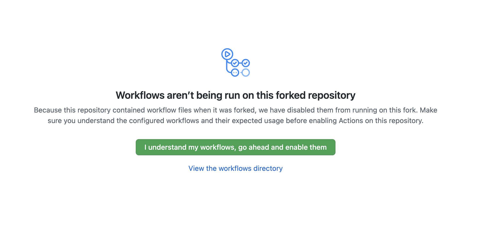

# Oppgave 1

## Lag en fork

Du må start med å lage en fork av dette repoet til din egen GitHub-konto.


## Logg i Cloud 9 miljøet ditt


* Logg på med din AWS bruker med URL, brukernavn og passord gitt i klassrommet
* Gå til tjenesten Cloud9 (Du nå søke på Cloud9 uten mellomrom i søket)
* Velg "Open IDE"
* Hvis du ikke ser ditt miljø, kan det hende du har valgt feil region. Hvilken region du skal bruke vil bli oppgitt i klasserommet.

### Lag et Access Token for GitHub

* Når du skal autentisere deg mot din GitHub konto fra Cloud 9 trenger du et access token.  Gå til  https://github.com/settings/tokens og lag et nytt.
* NB. Ta vare på tokenet et sted, du trenger dette senere når du skal gjøre ```git push```

Access token må ha "repo" tillatelser, og "workflow" tillatelser.


### Lage en klone av din Fork (av dette repoet) inn i ditt Cloud 9 miljø

Fra Terminal i Cloud 9. Klone repositoriet *ditt* med HTTPS URL.

```
git clone https://github.com/≤github bruker>/DevOps-Eksamen-2023.git
```

Får du denne feilmeldingen ```bash: /terraform-app-runner: Permission denied``` - så glemte du å bytte ut <github bruker> med
ditt eget Github brukernavn.

OBS Når du gjør ```git push``` senere og du skal autentisere deg, skal du bruke GitHub  brukernavn, og access token som passord,

For å slippe å autentisere seg hele tiden kan man få git til å cache nøkler i et valgfritt antall sekunder på denne måten;

```shell
git config --global credential.helper "cache --timeout=86400"
```

Konfigurer også brukernavnet og e-posten din for GitHub CLI. Da slipepr du advarsler i terminalen når du gjør commit senere.

````shell
git config --global user.name <github brukernavn>
git config --global user.email <email for github bruker>
````

## Slå på GitHub actions for din fork

I din fork av dette repositoriet, velg "actions" for å slå på støtte for GitHub actions i din fork.



### Lag Repository secrets

* Lag AWS IAM Access Keys for din bruker.  
* Se på .github/workflows/pipeline.yaml - Vi setter hemmeligheter ved å legge til følgende kodeblokk i github actions workflow fila vår slik at terraform kan autentisere seg med vår identitet, og våre rettigheter.


```yaml
    env:
      AWS_ACCESS_KEY_ID: ${{ secrets.AWS_ACCESS_KEY_ID }}
      AWS_SECRET_ACCESS_KEY: ${{ secrets.AWS_SECRET_ACCESS_KEY }}
      AWS_REGION: eu-west-1
```

## Skriv in i terminalen:
sett en miljøvariabel ```export BUCKET_NAME=your_s3bucket_name```
skriv ```echo $BUCKET_NAME``` for å se om riktig variabelen ble satt.

## Run app.py
```cd DevOps-Eksamen-2023/Kjell/hello_world```
```python3 app.py```
du vil få en respons om S3 bucket ble laget eller om allerede eksisterer

## GitHub Actions workflow

